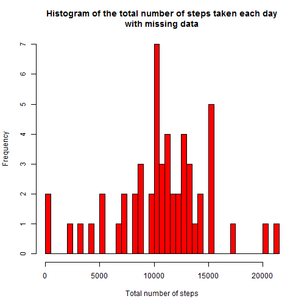
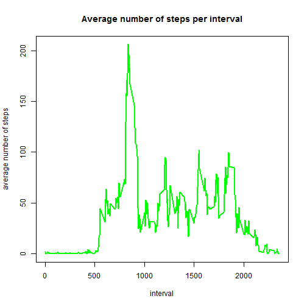
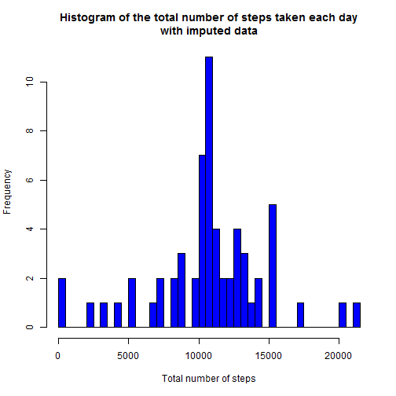
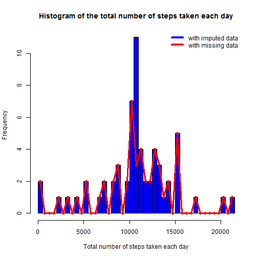
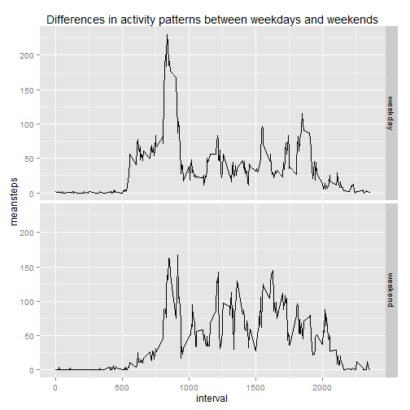

## Loading and preprocessing the data

Show any code that is needed to

Load the data (i.e. read.csv())

Process/transform the data (if necessary) into a format suitable for your analysis

```r
    library(dplyr)
    library(ggplot2) 
    activ<- read.csv("activity.csv")
    activt<-tbl_df(activ)
```

## What is mean total number of steps taken per day?


Make a histogram of the total number of steps taken each day


```r
    activgr<-group_by(activt,date)
    activsum<-summarize(activgr, totalsteps = sum(steps))
    ### Make a histogram of the total number of steps taken each day 
    hist1<-hist(activsum$totalsteps, breaks=50, col = "red",
         xlab = "Total number of steps",
         main = "Histogram of the total number of steps taken each day\nwith missing data")
```

 
 

#### Mean and median total number of steps taken per day with missing data


```r
    ### Calculate the mean and median total number of steps taken per day
    a<-mean(activsum$totalsteps, na.rm = TRUE)
    b<-median(activsum$totalsteps, na.rm = TRUE)
    print(paste("The mean total number of steps taken per day is", as.character(a)))
```

```
## [1] "The mean total number of steps taken per day is 10766.1886792453"
```

```r
    print(paste("The median total number of steps taken per day is", as.character(b)))
```

```
## [1] "The median total number of steps taken per day is 10765"
```


## What is the average daily activity pattern?


```r
    activtf<-filter(activt,is.na(steps)==FALSE)
    activtgint<-group_by(activtf,interval)
    activsumint<-summarize(activtgint, meansteps = mean(steps))
    with (activsumint,plot(interval,meansteps,type = "l",col = "green",lwd = 2,
        xlab = "interval",
        ylab ="average number of steps",
        main = "Average number of steps per interval"))
```

 

#### Which 5-minute interval, on average across all the days in the dataset, contains the maximum number of steps?


```r
    ### Define the 5-minute interval, on average across all the days in the dataset, contains the maximum number of steps
    maxstepsint<-max(activsumint$meansteps)
    maxint <-activsumint[activsumint$meansteps==maxstepsint,1]
    print(paste(as.character(maxint), "-th interval contains the maximum number of steps (" , as.character(maxstepsint),")"))
```

```
## [1] "835 -th interval contains the maximum number of steps ( 206.169811320755 )"
```


## Imputing missing values

#### Calculate the total number of missing values in the dataset 


```r
    ###Calculate the total number of missing values in the dataset 
    number_nas<-nrow(activ[is.na(activ$steps),])
    print(paste("The total number of missing values in the dataset is ", as.character(number_nas)))
```

```
## [1] "The total number of missing values in the dataset is  2304"
```

#### missing data filled in with rounded to integer mean for appropriate 5-minute interval


```r
    ### create a new dataset with the missing data filled in with mean for that 5-minute interval
    actvreplm<-merge(activ,as.data.frame(activsumint))
    actvreplm[is.na(actvreplm$steps),"steps"]<- round(actvreplm[is.na(actvreplm$steps),"meansteps"])
    actvreplmsum<-summarize(group_by(tbl_df(actvreplm),date),totalsteps = sum(steps))
    ### Make a histogram of the total number of steps taken each day 
    hist2<-hist(actvreplmsum$totalsteps, breaks=50, col = "blue",
         xlab = "Total number of steps",
         main = "Histogram of the total number of steps taken each day\nwith imputed data")
```

 


#### Mean and median total number of steps taken per day with imputing data


```r
    ### Calculate the mean and median total number of steps taken per day
    a<-mean(actvreplmsum$totalsteps)
    b<-median(actvreplmsum$totalsteps)
    print(paste("The mean total number of steps taken per day is", as.character(a)))
```

```
## [1] "The mean total number of steps taken per day is 10765.6393442623"
```

```r
    print(paste("The median total number of steps taken per day is", as.character(b)))
```

```
## [1] "The median total number of steps taken per day is 10762"
```


#### What is the impact of imputing missing data on the estimates of the total daily number of steps?

##### The impact of imputing missing data on the estimates of the total daily number of steps is illustrated with the following figure  
    

```r
    ### Show the impact of imputing missing data on the estimates of the total daily number of steps?
    hist2<-hist(actvreplmsum$totalsteps, breaks=50, col = "blue",
         xlab = "Total number of steps taken each day",
         main = "Histogram of the total number of steps taken each day")
    brw<-hist1$breaks[2]-hist1$breaks[1]
    hist1br<-hist1$breaks+0.5*brw
    hist1br<-hist1br[-length(hist1br)]
    points(hist1br,hist1$counts, col = "red",pch = 19)
    lines(hist1br,hist1$counts, col = "red",lwd = 3)
    legend( "topright", 
                legend = c("with imputed data ", "with missing data"),
                col=c("blue","red"), lwd=4, bty = "n")
```

 

```r
    maxcount<-max(hist2$counts)
    mval<-hist2$breaks[hist2$counts==maxcount]
    valhist1 <-hist1$counts[hist1$breaks==mval]
    print(paste("The number of days with", as.character(mval),"steps taken in total has increased from", as.character(valhist1), "to", as.character(maxcount),"after imputing data"))
```

```
## [1] "The number of days with 10500 steps taken in total has increased from 3 to 11 after imputing data"
```


## Are there differences in activity patterns between weekdays and weekends?


```r
    ###Create a new factor variable in the dataset with two levels -"weekday" and "weekend"- indicating whether a given date is a weekday or weekend day
    actvreplm$weekdays <- weekdays(as.Date(as.character(actvreplm$date)))
    actvreplm$weekdays <- ifelse(actvreplm$weekdays %in% c("Saturday","Sunday"), "weekend","weekday")
    actvreplweekdays<-summarize(group_by(tbl_df(actvreplm),weekdays, interval),meansteps = mean(steps))
    ###Make a panel plot containing a time series plot of the 5-minute interval (x-axis) and the average number of steps taken, averaged across all weekday days or weekend days (y-axis)
    
    qplot(interval, meansteps,data = actvreplweekdays, geom = "line", facets = weekdays~.,  main = "Differences in activity patterns between weekdays and weekends")
```

 
